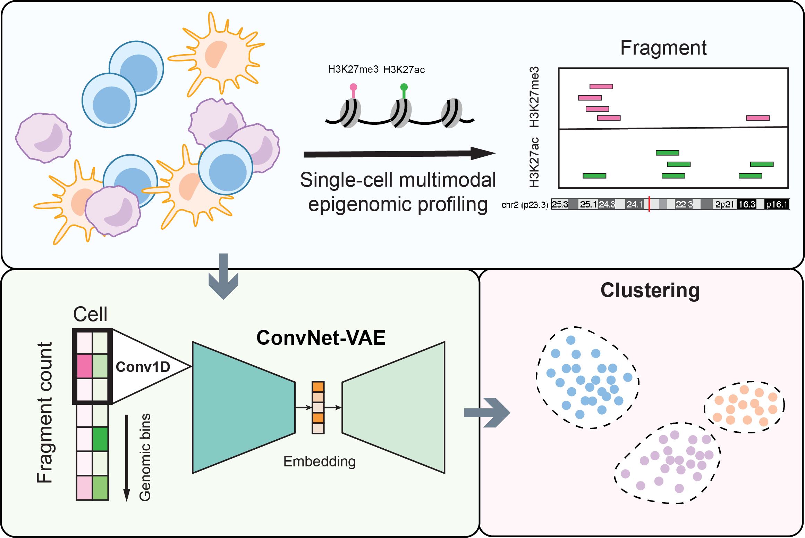

# ConvNet-VAE: Integrating single-cell multimodal epigenomic data using 1D-convolutional neural networks

## Introduction

The parallel profiling of histone modification and chromatin states at single-cell resolution provides a means to quantify the epigenetic landscape and delineate cell heterogeneity. A pivotal step in this process is the integration of these epigenomic modalities to learn a unified representation of each cell for accurate cell type inference. Here, we present `ConvNet-VAE`s, a novel framework based on 1D-convolutional variational autoencoders (VAEs), tailored for single-cell multimodal epigenomic data integration. We evaluated `ConvNet-VAE}`s on data generated from juvenile mouse brain and human bone marrow. Through benchmark analyses, we demonstrated that `ConvNet-VAE`s, despite utilizing substantially fewer parameters, deliver performance that is superior or comparable to traditional VAEs equipped with fully connected layers (`FC-VAE`s) in terms of dimension reduction and batch-effect correction.
